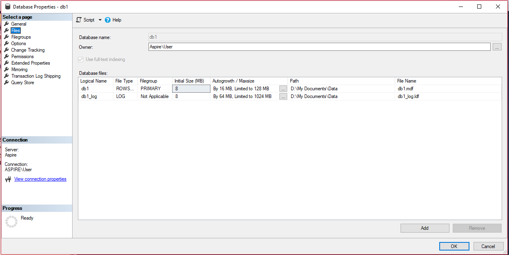
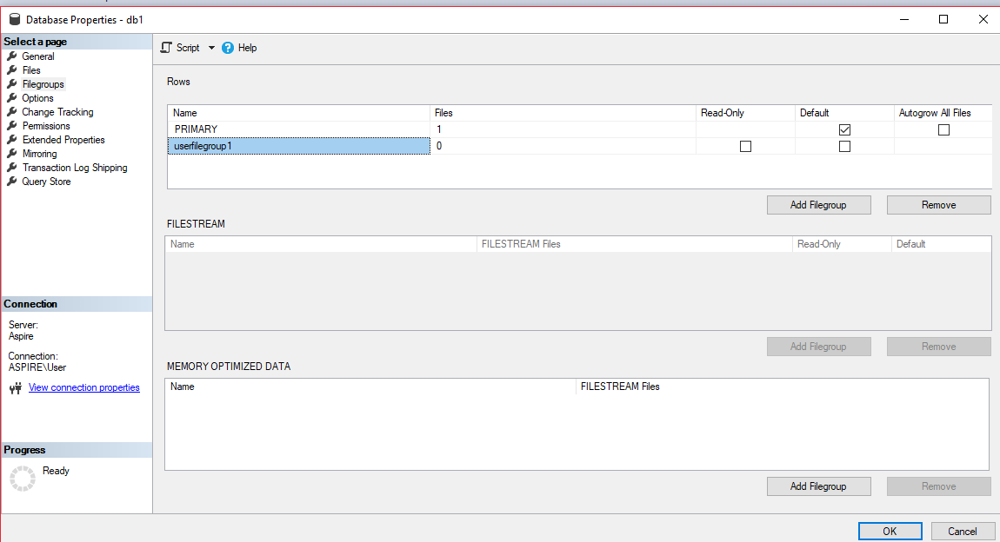
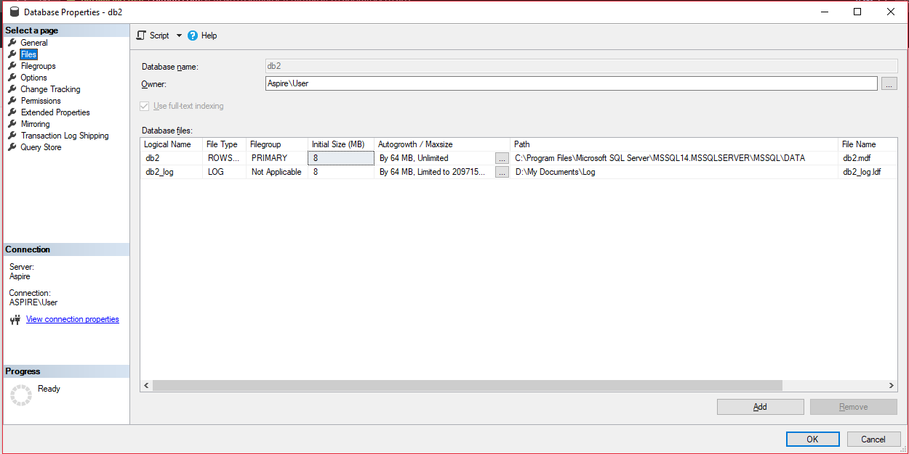
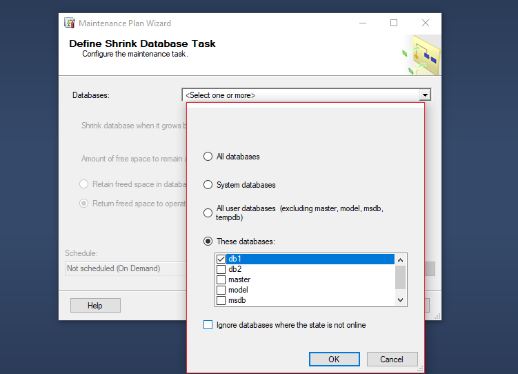
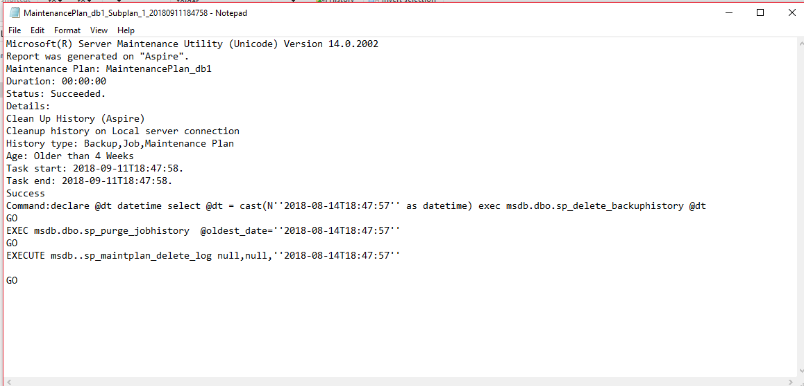
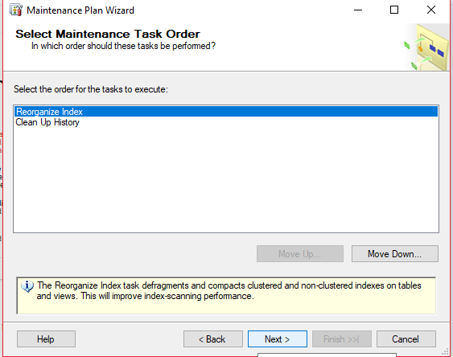
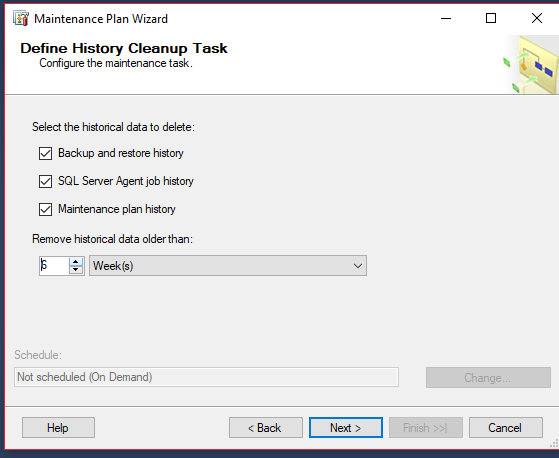
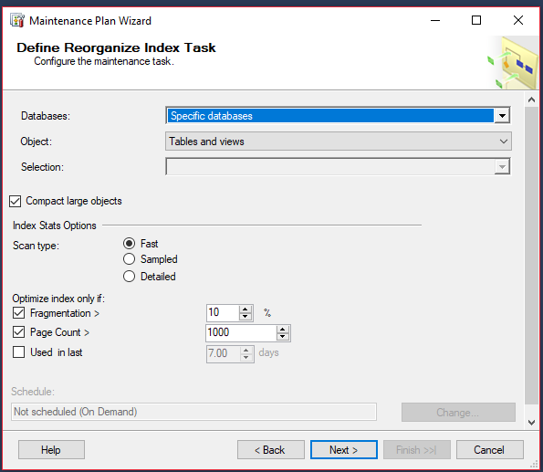
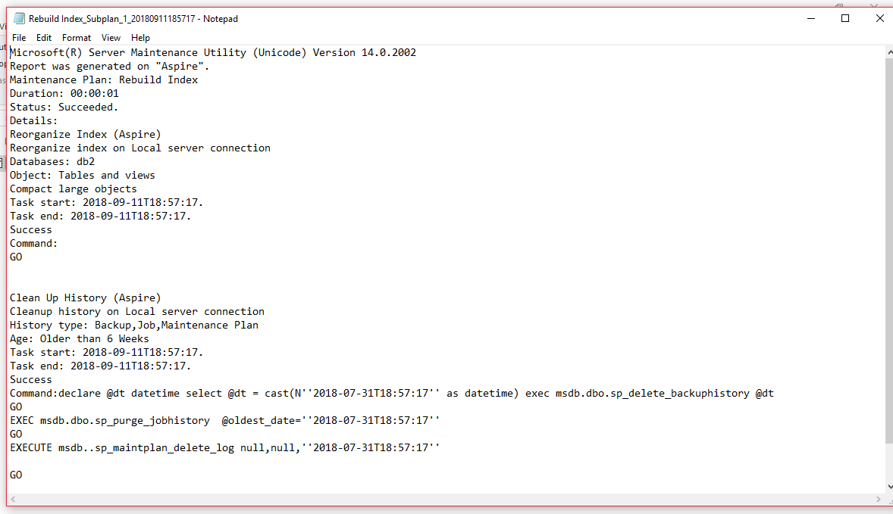

# Tasks for Laboratory work no. 2

1. Create a database physically placed in the map My Documents\Data, setting an increase of the primary file 
of 16 MB with the 
128 MB increase limit and the 64 MB log file with the 1024 MB increase limit.
For secondary files, define a new default Filegroup, 
setting the increase of secondary files from 64 MB with the limit of 1024 MB.
     

2. Create a database where log file is physically placed in the map My Documents\Log. 
It's important that only one user can acces 
this database

3. Create maintenance plan for database created in task 1. Unused files should be deleted when their size is more than 2000Mb. 

This task should be done every Friday at 12:00 AM. Report from this maintenance plan should be saved in My Documents\SQL_event_logs. 

Execute the plan. 

4. Create maintenance plan for database created in task 2. 
Plan name should be "Rebuild Index". In this plan, system should make 
index rebuilding only on primary tables from 
all schemas from that database. Free space on page should be 10%. Index sorting should
be in tempdb. After rebuild, 
is made statistics about all rebuild indexes. The third step of the plan is to clean up the history of 
operations of 
Backup-Restore what were made on Sql Server. Should be deleted the history older than 6 weeks. This plan should be executed 
every 
first Sunday of the month. Create folder MyDocuments\SQL_reports. Report should be stored in that folder. 
Maintenance plan should be 
logged in extended mode. Execute the plan and check the result in log file. 

