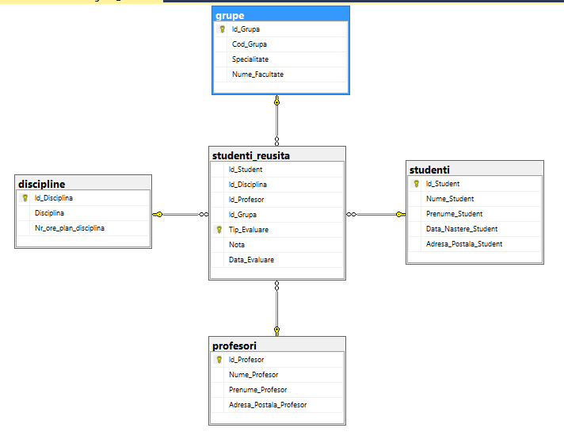

# Tasks for Laboratory work no. 3

1. Which of the following can be putted in *DECIMAL(4,1)* ?
a) 16,2
b) 116,2

2. Let [Col1] from the following table be of integer type, and [Col2] of DECIMAL(2,1) type. 
[Col3] should be *DECIMAL(2,1)* type.

3. Create a database named *universitatea* with default proprieties. Create 5 tables in this database (*grupe,discipline,profesori,studenti,studenti_reusita*), and show the diagram. 

